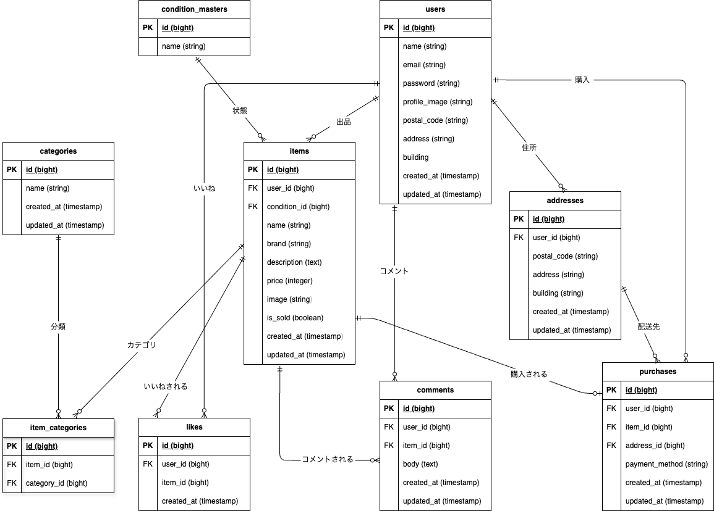

# furima-app

フリマアプリです。

## 開発環境

- **商品一覧（トップ）**: http://localhost/
- **ログイン**: http://localhost/login
- **会員登録**: http://localhost/register
- **データベース管理 (phpMyAdmin)**: http://localhost:8080/

## 使用技術（実行環境）

- PHP 8.1
- Laravel 8.x
- MySQL 8.0.26
- nginx 1.21.1

## 環境構築

```bash
# 1. リポジトリをクローン
git clone git@github.com:yoko-sakamaki/furima-app.git

# 2. プロジェクトに移動
cd furima-app

# 3. コンテナ起動
docker-compose up -d --build

# 4. コンテナ内に入る
docker-compose exec php bash
```

## Laravel環境構築 コンテナ内操作

```bash
# 1. ライブラリのインストール
composer install

# 2. 環境設定ファイルの作成
cp .env.example .env

# 3. アプリケーションキーの生成
php artisan key:generate

# 4. ストレージのシンボリックリンク作成（商品画像・プロフィール画像用）
php artisan storage:link

# 5. データベースのマイグレーション及びシーディング
php artisan migrate:fresh --seed
```

## 動作確認用ログイン情報

### 出品者アカウント
- メールアドレス: test@example.com
- パスワード: password123

### 購入者アカウント
- メールアドレス: test2@example.com
- パスワード: password123

## 確認手順

### 1. 会員登録・ログイン・ログアウト
1. `/register`で新規登録
2. `/login`でログイン（test@example.com / password123）
3. ヘッダーの「ログアウト」でログアウト

### 2. 商品一覧・検索
1. トップページで商品一覧を確認
2. 検索フォームで商品名を入力して検索
3. 「マイリスト」タブでいいねした商品を確認

### 3. 商品詳細・いいね・コメント
1. 商品をクリックして詳細を確認
2. ログイン状態でいいねボタンを押す
3. コメントを入力して送信する

### 4. 商品購入
1. test2@example.com / password123でログイン
2. 商品詳細から「購入手続きへ」を押す
3. 支払い方法を選択
4. 必要に応じて配送先を変更
5. 「購入する」ボタンを押す
6. マイページの「購入した商品」に表示されることを確認

### 5. 商品出品
1. test@example.com / password123でログイン
2. ヘッダーの「出品」を押す
3. 商品情報を入力して「出品する」を押す
4. トップページに出品した商品が表示されることを確認

### 6. マイページ・プロフィール編集
1. ログイン状態でヘッダーの「マイページ」を押す
2. 「プロフィールを編集」を押す
3. 情報を入力して「更新する」を押す

## ER図

